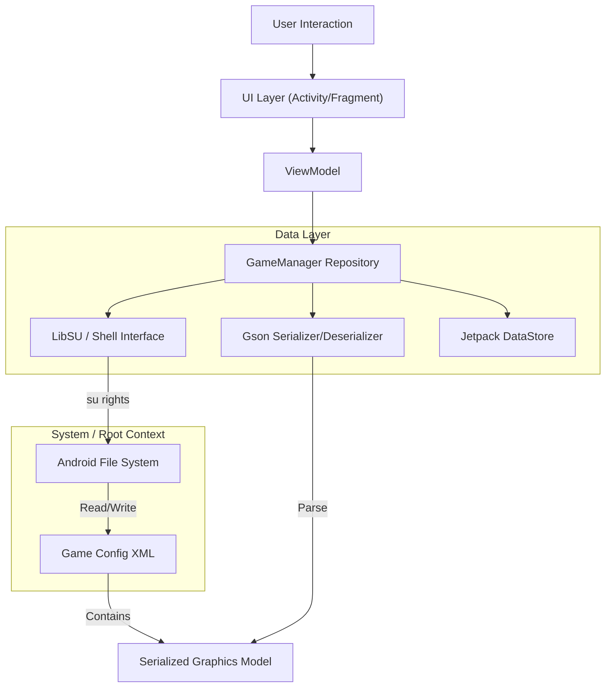

# HSR Graphic Droid

<div align="center">
  
</div>


<div align="center">

[](https://www.android.com)
[](https://kotlinlang.org)
[](https://github.com/topjohnwu/Magisk)
[](LICENSE)
[](https://github.com/iRedDragonICY/HsrGraphicDroid/actions)

**English** | **[Indonesia](README_ID.md)** | **[中文](README_CN.md)** | **[日本語](README_JP.md)**

</div>

## Overview

**HSR Graphic Droid** is a sophisticated utility application engineered for the Android ecosystem, designed to bypass the standard limitations of the *Honkai: Star Rail* graphics configuration menu. By leveraging root privileges (KernelSU, Magisk, or APatch), it directly interacts with the Unity engine's preference files (`playerprefs.xml`), unlocking granular control over rendering pipelines, resolution scaling, and asset management.

This tool is intended for power users, developers, and enthusiasts seeking to optimize performance on low-end hardware or push graphical fidelity on flagship devices beyond the game's official "Ultra" presets.

## Key Features

### 🛠 Core Engineering
*   **Direct Config Manipulation:** Bypasses in-game UI restrictions by reading/writing directly to the Unity `GraphicsSettings_Model` serialized JSON.
*   **Root-Level File Operations:** Utilizes `libsu` for atomic file operations, ensuring configuration integrity even when the game processes are suspended.
*   **Safety Backup System:** Automated JSON-based backup and restore functionality with timestamping, allowing instant rollback to stable configurations.

### ⚡ Performance & Quality
*   **Unlocked Framerates:** Force enabling of 120 FPS modes on devices not officially whitelisted.
*   **Custom Resolution Scaling:** Decouples rendering resolution from screen resolution (0.5x to 2.0x) for precise PPI targeting.
*   **Advanced Upscaling Injection:** Toggles for hidden Unity engine parameters including MetalFX Super Resolution, DLSS Quality, and Half-Res Transparencies.
*   **Dual Quality System:** Separate controls for Unity Master Quality (game presets) and Extended Settings (custom values that can exceed game limits).

### 🔧 Asset Management
*   **Blacklist Viewer:** View blocked `.usm` (Video) and `.pck` (Audio) assets. (View-only to prevent accidental game data re-downloads)
*   **Locale Force-Switch:** Modify Text and Audio language integers directly, bypassing region lock logic.

## Technical Architecture

The application follows strictly typed Clean Architecture principles using MVVM patterns and modern Android Jetpack libraries.



## Configuration Reference

HSR Graphic Droid exposes the complete array of Unity rendering parameters. Below is the technical specification of every modifiable setting.

### Rendering & Performance

| Parameter | Type | Range | Description |
| :--- | :--- | :--- | :--- |
| **FPS** | `int` | `30` - `120` | Target frame rate cap. Setting to 120 overrides device whitelisting. |
| **Render Scale** | `float` | `0.5` - `2.0` | Internal rendering resolution multiplier relative to the window size. |
| **Resolution Quality** | `int` | `0` - `5` | Preset quality level for texture resolution and mipmaps. |
| **VSync** | `bool` | `On` / `Off` | Synchronizes frame rate with display refresh rate to prevent tearing. |
| **Anti-Aliasing Mode** | `enum` | `0` (Off), `1` (TAA), `2` (SMAA) | Post-processing edge smoothing technique. |
| **MetalFX SU** | `bool` | `On` / `Off` | **Experimental:** Apple's upscaling tech. May cause artifacts on Android (Snapdragon/Mali). |
| **DLSS Quality** | `int` | `0` - `4` | **Experimental:** Deep Learning Super Sampling level. Primarily for non-mobile platforms. |
| **Half Res Transparent** | `bool` | `On` / `Off` | Renders transparency effects (smoke, magic) at 50% resolution for performance. |

### Visual Fidelity

| Parameter | Type | Range | Description |
| :--- | :--- | :--- | :--- |
| **Graphics Quality** | `int` | `0` - `5` | Master switch. `0`=Custom (uses Extended Settings below), `1`-`5`=Game presets (overrides individual settings). |
| **Shadow Quality** | `int` | `0` - `5` | Resolution of shadow maps and cascade distance. |
| **Light Quality** | `int` | `0` - `5` | Complexity of dynamic lighting and volumetric fog. |
| **Character Quality** | `int` | `0` - `5` | LOD (Level of Detail) bias for character models. |
| **Env Detail Quality** | `int` | `0` - `5` | LOD bias for world geometry and draw distance. |
| **Reflection Quality** | `int` | `0` - `5` | Resolution and update rate of screen-space reflections (SSR). |
| **SFX Quality** | `int` | `1` - `5` | Density and lifetime of particle systems. Note: `0` is invalid, minimum is `1` (Very Low). |
| **Bloom Quality** | `int` | `0` - `5` | Intensity and spread of the light bloom post-processing effect. |
| **Self Shadow** | `int` | `0` - `2` | Computation of shadows cast by character onto themselves. |
| **Particle Trail** | `int` | `0` - `3` | Smoothness and segments of moving particle trails. |

### System & Windowing (View Only)

These settings are **read-only** and displayed for informational purposes. The game uses the device's native screen resolution and cannot be modified through this app.

| Parameter | Type | Description |
| :--- | :--- | :--- |
| **Resolution Width** | `int` | Horizontal resolution of the viewport (read from game). |
| **Resolution Height** | `int` | Vertical resolution of the viewport (read from game). |
| **Fullscreen Mode** | `enum` | `0`: Fullscreen Window, `1`: Exclusive, `2`: Maximized, `3`: Windowed (read from game). |
| **Speed Up Open** | `int` | Optimization flag to potentially skip integrity checks on launch. |

## Game Preferences (Non-Graphics)

Beyond visual settings, the app displays `GamePreferences` for utility purposes:

*   **Video Blacklist (View Only):** Displays blocked video filenames (e.g., `Cutscene_01.usm`). Editing is disabled to prevent game data re-download.
*   **Audio Blacklist (View Only):** Displays blocked `.pck` audio containers. Editing is disabled to prevent game data re-download.
*   **Language Settings:**
    *   **Text:** `0` (CN), `1` (TW), `2` (EN), `3` (JP), `4` (KR), `8` (ID), `9` (RU), etc.
    *   **Audio:** `0` (CN), `1` (EN), `2` (JP), `3` (KR).

> **Note:** Blacklist editing has been disabled because modifying these lists can cause the game to re-download data files. Only language settings can be changed in the Game Preferences screen.

## Installation & Prerequisites

### Requirements
1.  **Android OS:** 8.0 (Oreo) or higher.
2.  **Root Access:** Magisk, KernelSU, or APatch is **mandatory**.
3.  **Installed Game:** *Honkai: Star Rail* must be installed and initialized at least once.

### Installation
1.  Download the latest signed APK from the [Releases](https://github.com/iRedDragonICY/HsrGraphicDroid/releases) page.
2.  Install the APK on your device.
3.  Launch **HSR Graphic Droid**.
4.  When prompted, grant **Superuser** permissions via your root manager.

## Building from Source

To build this project locally, ensure you have Android Studio Koala or newer installed.

```bash
# 1. Clone the repository
git clone https://github.com/iRedDragonICY/HsrGraphicDroid.git

# 2. Navigate to project directory
cd HsrGraphicDroid

# 3. Build Debug APK
./gradlew assembleDebug

# 4. Output location
# app/build/outputs/apk/debug/app-debug.apk
```

## Tech Stack

*   **Language:** [Kotlin](https://kotlinlang.org/)
*   **UI Framework:** [XML / Material Design 3](https://m3.material.io/)
*   **Root Interface:** [LibSU](https://github.com/topjohnwu/libsu) (by topjohnwu)
*   **Concurrency:** [Kotlin Coroutines](https://github.com/Kotlin/kotlinx.coroutines)
*   **Serialization:** [Gson](https://github.com/google/gson)
*   **Architecture:** MVVM, Repository Pattern

## License

Copyright © 2025 iRedDragonICY.

This project is licensed under the Apache License, Version 2.0. See the [LICENSE](LICENSE) file for details.

---

<div align="center">
    <sub>Disclaimer: This software is not affiliated with, endorsed, sponsored, or specifically approved by HoYoverse/Cognosphere. Use at your own risk. Modifying game files may violate Terms of Service.</sub>
</div>
