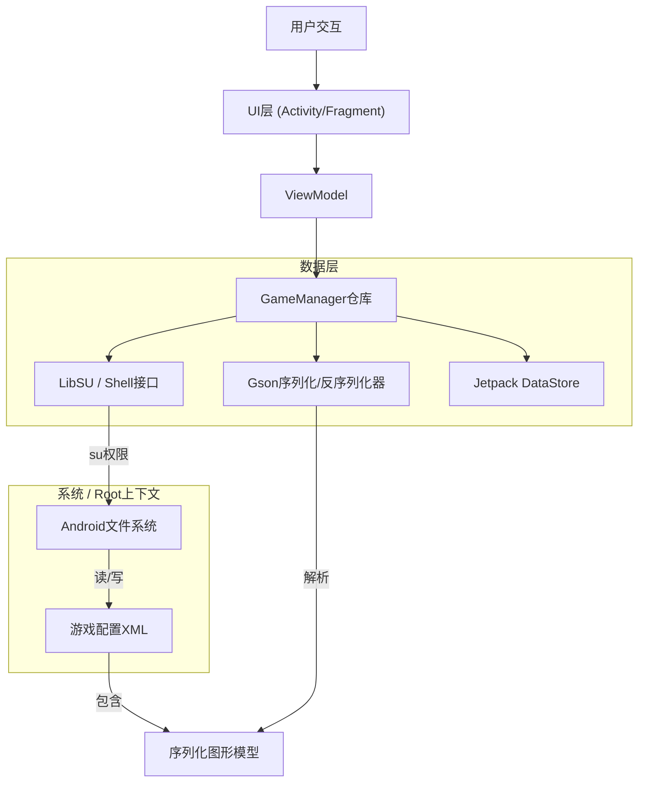

# HSR Graphic Droid

<div align="center">
  
</div>


<div align="center">

[](https://www.android.com)
[](https://kotlinlang.org)
[](https://github.com/topjohnwu/Magisk)
[](LICENSE)

**[English](README.md)** | **[Indonesia](README_ID.md)** | **中文** | **[日本語](README_JP.md)**

</div>

## 概述

<table>
<tr>
<td width="70%">

**HSR Graphic Droid** 是一款专为Android生态系统设计的高级实用工具应用，旨在绕过*崩坏：星穹铁道*图形配置菜单的标准限制。通过利用root权限（KernelSU、Magisk或APatch），它直接与Unity引擎的偏好设置文件（`playerprefs.xml`）交互，解锁对渲染管线、分辨率缩放和资源管理的精细控制。

此工具面向希望在低端硬件上优化性能或在旗舰设备上将图形保真度推向超越游戏官方"极致"预设的高级用户、开发者和爱好者。

</td>
<td width="30%" align="center">


**HSR Graphic Droid**

*高级图形控制*

</td>
</tr>
</table>

## 核心功能

### 🛠 核心工程
*   **直接配置操作：** 通过直接读写Unity的`GraphicsSettings_Model`序列化JSON来绕过游戏内UI限制。
*   **Root级文件操作：** 使用`libsu`进行原子文件操作，确保即使游戏进程挂起时配置的完整性。
*   **安全备份系统：** 基于JSON的自动备份和恢复功能，带有时间戳，允许即时回滚到稳定配置。

### ⚡ 性能与质量
*   **解锁帧率：** 在未被官方白名单的设备上强制启用120 FPS模式。
*   **自定义分辨率缩放：** 将渲染分辨率与屏幕分辨率解耦（0.5x到2.0x），实现精确的PPI定位。
*   **高级超采样注入：** 切换隐藏的Unity引擎参数，包括MetalFX超分辨率、DLSS质量和半分辨率透明度。
*   **双质量系统：** Unity主质量（游戏预设）和扩展设置（可超越游戏限制的自定义值）的独立控制。

### 🔧 资源管理
*   **黑名单查看器：** 查看被阻止的`.usm`（视频）和`.pck`（音频）资源。（只读，防止意外重新下载游戏数据）
*   **强制语言切换：** 直接修改文本和音频语言整数，绕过区域锁定逻辑。

## 技术架构

应用程序遵循严格类型的Clean Architecture原则，使用MVVM模式和现代Android Jetpack库。



## 配置参考

HSR Graphic Droid公开了Unity渲染参数的完整数组。以下是每个可修改设置的技术规格。

### 渲染与性能

| 参数 | 类型 | 范围 | 描述 |
| :--- | :--- | :--- | :--- |
| **FPS** | `int` | `30` - `120` | 目标帧率上限。设置为120会覆盖设备白名单。 |
| **渲染缩放** | `float` | `0.5` - `2.0` | 相对于窗口大小的内部渲染分辨率倍数。 |
| **分辨率质量** | `int` | `0` - `5` | 纹理分辨率和mipmap的预设质量级别。 |
| **垂直同步** | `bool` | `开` / `关` | 将帧率与显示器刷新率同步以防止撕裂。 |
| **抗锯齿模式** | `enum` | `0`（关）、`1`（TAA）、`2`（SMAA） | 后处理边缘平滑技术。 |
| **MetalFX SU** | `bool` | `开` / `关` | **实验性：** Apple的超采样技术。可能在Android（骁龙/Mali）上产生伪影。 |
| **DLSS质量** | `int` | `0` - `4` | **实验性：** 深度学习超采样级别。主要用于非移动平台。 |
| **半分辨率透明** | `bool` | `开` / `关` | 以50%分辨率渲染透明效果（烟雾、魔法）以提高性能。 |

### 视觉保真度

| 参数 | 类型 | 范围 | 描述 |
| :--- | :--- | :--- | :--- |
| **图形质量** | `int` | `0` - `5` | 主开关。`0`=自定义（使用下方扩展设置），`1`-`5`=游戏预设（覆盖单独设置）。 |
| **阴影质量** | `int` | `0` - `5` | 阴影贴图分辨率和级联距离。 |
| **光照质量** | `int` | `0` - `5` | 动态光照和体积雾的复杂度。 |
| **角色质量** | `int` | `0` - `5` | 角色模型的LOD（细节层次）偏差。 |
| **环境细节质量** | `int` | `0` - `5` | 世界几何体和绘制距离的LOD偏差。 |
| **反射质量** | `int` | `0` - `5` | 屏幕空间反射（SSR）的分辨率和更新率。 |
| **特效质量** | `int` | `1` - `5` | 粒子系统的密度和生命周期。注意：`0`无效，最小值为`1`（极低）。 |
| **泛光质量** | `int` | `0` - `5` | 光晕后处理效果的强度和扩散。 |
| **自阴影** | `int` | `0` - `2` | 角色投射到自身的阴影计算。 |
| **粒子拖尾** | `int` | `0` - `3` | 移动粒子拖尾的平滑度和分段。 |

### 系统与窗口（仅查看）

这些设置是**只读**的，仅用于显示信息。游戏使用设备的原生屏幕分辨率，无法通过此应用修改。

| 参数 | 类型 | 描述 |
| :--- | :--- | :--- |
| **分辨率宽度** | `int` | 视口的水平分辨率（从游戏读取）。 |
| **分辨率高度** | `int` | 视口的垂直分辨率（从游戏读取）。 |
| **全屏模式** | `enum` | `0`：全屏窗口，`1`：独占全屏，`2`：最大化窗口，`3`：窗口化（从游戏读取）。 |
| **快速启动** | `int` | 优化标志，可能跳过启动时的完整性检查。 |

## 游戏偏好设置（非图形）

除视觉设置外，应用程序还显示`GamePreferences`用于实用目的：

*   **视频黑名单（仅查看）：** 显示被阻止的视频文件名（例如`Cutscene_01.usm`）。编辑已禁用以防止重新下载游戏数据。
*   **音频黑名单（仅查看）：** 显示被阻止的`.pck`音频容器。编辑已禁用以防止重新下载游戏数据。
*   **语言设置：**
    *   **文本：** `0`（简中）、`1`（繁中）、`2`（英语）、`3`（日语）、`4`（韩语）、`8`（印尼语）、`9`（俄语）等。
    *   **音频：** `0`（中文）、`1`（英语）、`2`（日语）、`3`（韩语）。

> **注意：** 黑名单编辑已被禁用，因为修改这些列表可能导致游戏重新下载数据文件。只有语言设置可以在游戏偏好设置界面中更改。

## 安装与前提条件

### 要求
1.  **Android系统：** 8.0（Oreo）或更高版本。
2.  **Root权限：** Magisk、KernelSU或APatch是**必需的**。
3.  **已安装游戏：** *崩坏：星穹铁道*必须已安装并至少初始化一次。

### 安装步骤
1.  从[Releases](https://github.com/iRedDragonICY/HsrGraphicDroid/releases)页面下载最新的签名APK。
2.  在您的设备上安装APK。
3.  启动**HSR Graphic Droid**。
4.  出现提示时，通过您的root管理器授予**超级用户**权限。

## 从源代码构建

要在本地构建此项目，请确保您已安装Android Studio Koala或更新版本。

```bash
# 1. 克隆仓库
git clone https://github.com/iRedDragonICY/HsrGraphicDroid.git

# 2. 进入项目目录
cd HsrGraphicDroid

# 3. 构建Debug APK
./gradlew assembleDebug

# 4. 输出位置
# app/build/outputs/apk/debug/app-debug.apk
```

## 技术栈

*   **语言：** [Kotlin](https://kotlinlang.org/)
*   **UI框架：** [XML / Material Design 3](https://m3.material.io/)
*   **Root接口：** [LibSU](https://github.com/topjohnwu/libsu)（由topjohnwu开发）
*   **并发：** [Kotlin协程](https://github.com/Kotlin/kotlinx.coroutines)
*   **序列化：** [Gson](https://github.com/google/gson)
*   **架构：** MVVM、Repository模式

## 许可证

版权所有 © 2025 iRedDragonICY。

本项目采用Apache许可证2.0版授权。详情请参阅[LICENSE](LICENSE)文件。

---

<div align="center">
    <sub>免责声明：本软件与HoYoverse/Cognosphere无关，未经其认可、赞助或特别批准。使用风险自负。修改游戏文件可能违反服务条款。</sub>
</div>
