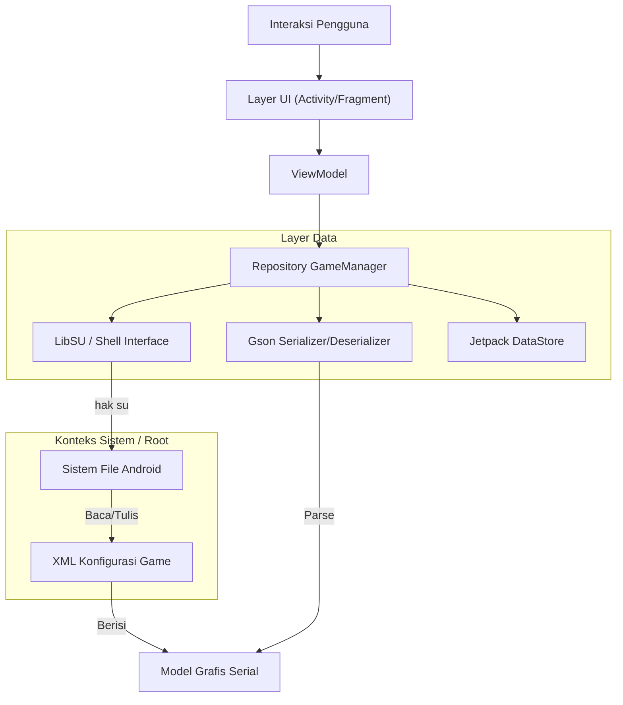

# HSR Graphic Droid


<div align="center">

[](https://www.android.com)
[](https://kotlinlang.org)
[](https://github.com/topjohnwu/Magisk)
[](LICENSE)

**[English](README.md)** | **Indonesia** | **[中文](README_CN.md)** | **[日本語](README_JP.md)**

</div>

## Ringkasan

<table>
<tr>
<td width="70%">

**HSR Graphic Droid** adalah aplikasi utilitas canggih yang dirancang untuk ekosistem Android, dibuat untuk melewati batasan standar menu konfigurasi grafis *Honkai: Star Rail*. Dengan memanfaatkan hak akses root (KernelSU, Magisk, atau APatch), aplikasi ini berinteraksi langsung dengan file preferensi Unity engine (`playerprefs.xml`), membuka kontrol granular atas pipeline rendering, skala resolusi, dan manajemen aset.

Alat ini ditujukan untuk pengguna tingkat lanjut, developer, dan penggemar yang ingin mengoptimalkan performa di perangkat low-end atau mendorong kualitas grafis di perangkat flagship melampaui preset "Ultra" resmi game.

</td>
<td width="30%" align="center">


**HSR Graphic Droid**

*Kontrol Grafis Lanjutan*

</td>
</tr>
</table>

## Fitur Utama

### 🛠 Rekayasa Inti
*   **Manipulasi Konfigurasi Langsung:** Melewati batasan UI dalam game dengan membaca/menulis langsung ke JSON serial `GraphicsSettings_Model` Unity.
*   **Operasi File Level Root:** Menggunakan `libsu` untuk operasi file atomik, memastikan integritas konfigurasi bahkan saat proses game ditangguhkan.
*   **Sistem Backup Otomatis:** Fungsionalitas backup dan restore berbasis JSON dengan timestamp, memungkinkan rollback instan ke konfigurasi stabil.

### ⚡ Performa & Kualitas
*   **Framerate Terbuka:** Mengaktifkan paksa mode 120 FPS pada perangkat yang tidak resmi di-whitelist.
*   **Skala Resolusi Kustom:** Memisahkan resolusi rendering dari resolusi layar (0.5x hingga 2.0x) untuk penargetan PPI yang presisi.
*   **Injeksi Upscaling Lanjutan:** Toggle untuk parameter tersembunyi Unity engine termasuk MetalFX Super Resolution, Kualitas DLSS, dan Half-Res Transparencies.
*   **Sistem Kualitas Ganda:** Kontrol terpisah untuk Unity Master Quality (preset game) dan Extended Settings (nilai kustom yang bisa melampaui batas game).

### 🔧 Manajemen Aset
*   **Penampil Blacklist:** Melihat aset `.usm` (Video) dan `.pck` (Audio) yang diblokir. (Hanya-baca untuk mencegah re-download data game yang tidak disengaja)
*   **Pengubah Bahasa Paksa:** Mengubah integer bahasa Teks dan Audio secara langsung, melewati logika region lock.

## Arsitektur Teknis

Aplikasi mengikuti prinsip Clean Architecture dengan tipe ketat menggunakan pola MVVM dan library Android Jetpack modern.



## Referensi Konfigurasi

HSR Graphic Droid mengekspos array lengkap parameter rendering Unity. Berikut spesifikasi teknis setiap pengaturan yang dapat dimodifikasi.

### Rendering & Performa

| Parameter | Tipe | Rentang | Deskripsi |
| :--- | :--- | :--- | :--- |
| **FPS** | `int` | `30` - `120` | Batas target frame rate. Mengatur ke 120 menimpa whitelist perangkat. |
| **Render Scale** | `float` | `0.5` - `2.0` | Pengali resolusi rendering internal relatif terhadap ukuran window. |
| **Resolution Quality** | `int` | `0` - `5` | Level preset kualitas untuk resolusi tekstur dan mipmap. |
| **VSync** | `bool` | `Aktif` / `Nonaktif` | Menyinkronkan frame rate dengan refresh rate display untuk mencegah tearing. |
| **Mode Anti-Aliasing** | `enum` | `0` (Mati), `1` (TAA), `2` (SMAA) | Teknik smoothing tepi post-processing. |
| **MetalFX SU** | `bool` | `Aktif` / `Nonaktif` | **Eksperimental:** Teknologi upscaling Apple. Mungkin menyebabkan artefak di Android (Snapdragon/Mali). |
| **Kualitas DLSS** | `int` | `0` - `4` | **Eksperimental:** Level Deep Learning Super Sampling. Utamanya untuk platform non-mobile. |
| **Half Res Transparent** | `bool` | `Aktif` / `Nonaktif` | Merender efek transparansi (asap, sihir) pada resolusi 50% untuk performa. |

### Fidelitas Visual

| Parameter | Tipe | Rentang | Deskripsi |
| :--- | :--- | :--- | :--- |
| **Graphics Quality** | `int` | `0` - `5` | Switch master. `0`=Kustom (menggunakan Extended Settings di bawah), `1`-`5`=Preset game (menimpa pengaturan individual). |
| **Shadow Quality** | `int` | `0` - `5` | Resolusi shadow map dan jarak cascade. |
| **Light Quality** | `int` | `0` - `5` | Kompleksitas pencahayaan dinamis dan fog volumetrik. |
| **Character Quality** | `int` | `0` - `5` | Bias LOD (Level of Detail) untuk model karakter. |
| **Env Detail Quality** | `int` | `0` - `5` | Bias LOD untuk geometri dunia dan jarak gambar. |
| **Reflection Quality** | `int` | `0` - `5` | Resolusi dan laju update refleksi screen-space (SSR). |
| **SFX Quality** | `int` | `1` - `5` | Kepadatan dan masa hidup sistem partikel. Catatan: `0` tidak valid, minimum adalah `1` (Sangat Rendah). |
| **Bloom Quality** | `int` | `0` - `5` | Intensitas dan spread efek post-processing light bloom. |
| **Self Shadow** | `int` | `0` - `2` | Komputasi bayangan yang dihasilkan karakter ke diri sendiri. |
| **Particle Trail** | `int` | `0` - `3` | Kehalusan dan segmen trail partikel bergerak. |

### Sistem & Windowing (Hanya Lihat)

Pengaturan ini **hanya-baca** dan ditampilkan untuk tujuan informasi. Game menggunakan resolusi layar native perangkat dan tidak dapat dimodifikasi melalui aplikasi ini.

| Parameter | Tipe | Deskripsi |
| :--- | :--- | :--- |
| **Resolution Width** | `int` | Resolusi horizontal viewport (dibaca dari game). |
| **Resolution Height** | `int` | Resolusi vertikal viewport (dibaca dari game). |
| **Fullscreen Mode** | `enum` | `0`: Fullscreen Window, `1`: Exclusive, `2`: Maximized, `3`: Windowed (dibaca dari game). |
| **Speed Up Open** | `int` | Flag optimisasi untuk berpotensi melewati pemeriksaan integritas saat peluncuran. |

## Preferensi Game (Non-Grafis)

Selain pengaturan visual, aplikasi menampilkan `GamePreferences` untuk keperluan utilitas:

*   **Blacklist Video (Hanya Lihat):** Menampilkan nama file video yang diblokir (misalnya `Cutscene_01.usm`). Pengeditan dinonaktifkan untuk mencegah re-download data game.
*   **Blacklist Audio (Hanya Lihat):** Menampilkan container audio `.pck` yang diblokir. Pengeditan dinonaktifkan untuk mencegah re-download data game.
*   **Pengaturan Bahasa:**
    *   **Teks:** `0` (CN), `1` (TW), `2` (EN), `3` (JP), `4` (KR), `8` (ID), `9` (RU), dll.
    *   **Audio:** `0` (CN), `1` (EN), `2` (JP), `3` (KR).

> **Catatan:** Pengeditan blacklist telah dinonaktifkan karena memodifikasi daftar ini dapat menyebabkan game me-download ulang file data. Hanya pengaturan bahasa yang dapat diubah di layar Preferensi Game.

## Instalasi & Prasyarat

### Persyaratan
1.  **Android OS:** 8.0 (Oreo) atau lebih tinggi.
2.  **Akses Root:** Magisk, KernelSU, atau APatch **wajib**.
3.  **Game Terinstal:** *Honkai: Star Rail* harus terinstal dan diinisialisasi setidaknya sekali.

### Instalasi
1.  Unduh APK terbaru yang sudah ditandatangani dari halaman [Releases](https://github.com/iRedDragonICY/HsrGraphicDroid/releases).
2.  Instal APK di perangkat Anda.
3.  Jalankan **HSR Graphic Droid**.
4.  Saat diminta, berikan izin **Superuser** melalui root manager Anda.

## Build dari Source

Untuk build proyek ini secara lokal, pastikan Anda telah menginstal Android Studio Koala atau lebih baru.

```bash
# 1. Clone repository
git clone https://github.com/iRedDragonICY/HsrGraphicDroid.git

# 2. Masuk ke direktori proyek
cd HsrGraphicDroid

# 3. Build Debug APK
./gradlew assembleDebug

# 4. Lokasi output
# app/build/outputs/apk/debug/app-debug.apk
```

## Tech Stack

*   **Bahasa:** [Kotlin](https://kotlinlang.org/)
*   **Framework UI:** [XML / Material Design 3](https://m3.material.io/)
*   **Interface Root:** [LibSU](https://github.com/topjohnwu/libsu) (oleh topjohnwu)
*   **Concurrency:** [Kotlin Coroutines](https://github.com/Kotlin/kotlinx.coroutines)
*   **Serialisasi:** [Gson](https://github.com/google/gson)
*   **Arsitektur:** MVVM, Repository Pattern

## Lisensi

Hak Cipta © 2025 iRedDragonICY.

Proyek ini dilisensikan di bawah Apache License, Version 2.0. Lihat file [LICENSE](LICENSE) untuk detail.

---

<div align="center">
    <sub>Disclaimer: Perangkat lunak ini tidak berafiliasi dengan, didukung, disponsori, atau secara khusus disetujui oleh HoYoverse/Cognosphere. Gunakan dengan risiko Anda sendiri. Memodifikasi file game dapat melanggar Ketentuan Layanan.</sub>
</div>
