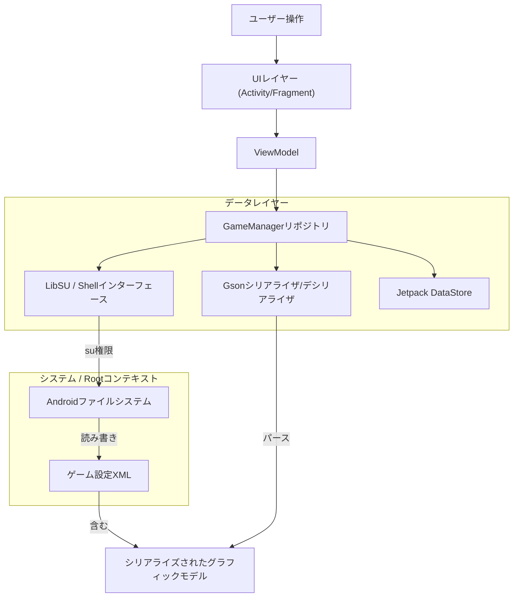

# HSR Graphic Droid

<div align="center">
  
</div>


<div align="center">

[](https://www.android.com)
[](https://kotlinlang.org)
[](https://github.com/topjohnwu/Magisk)
[](LICENSE)

**[English](README.md)** | **[Indonesia](README_ID.md)** | **[中文](README_CN.md)** | **日本語**

</div>

## 概要

<table>
<tr>
<td width="70%">

**HSR Graphic Droid**は、Androidエコシステム向けに設計された高度なユーティリティアプリケーションで、*崩壊：スターレイル*のグラフィック設定メニューの標準的な制限を回避するために開発されました。Root権限（KernelSU、Magisk、またはAPatch）を活用することで、Unityエンジンの設定ファイル（`playerprefs.xml`）に直接アクセスし、レンダリングパイプライン、解像度スケーリング、アセット管理の詳細な制御を可能にします。

このツールは、ローエンドハードウェアでのパフォーマンス最適化や、フラッグシップデバイスでゲームの公式「ウルトラ」プリセットを超えるグラフィック品質を追求するパワーユーザー、開発者、愛好家を対象としています。

</td>
<td width="30%" align="center">


**HSR Graphic Droid**

*高度なグラフィック制御*

</td>
</tr>
</table>

## 主な機能

### 🛠 コアエンジニアリング
*   **直接設定操作：** Unityの`GraphicsSettings_Model`シリアライズJSONを直接読み書きすることで、ゲーム内UI制限を回避します。
*   **Rootレベルファイル操作：** `libsu`を使用したアトミックファイル操作により、ゲームプロセスが一時停止している場合でも設定の整合性を確保します。
*   **安全バックアップシステム：** タイムスタンプ付きのJSON形式による自動バックアップ・リストア機能で、安定した設定への即時ロールバックが可能です。

### ⚡ パフォーマンスと品質
*   **フレームレート解除：** 公式にホワイトリストされていないデバイスでも120 FPSモードを強制的に有効化。
*   **カスタム解像度スケーリング：** レンダリング解像度を画面解像度から切り離し（0.5x〜2.0x）、正確なPPIターゲティングを実現。
*   **高度なアップスケーリング注入：** MetalFXスーパーレゾリューション、DLSS品質、半解像度透明度など、隠されたUnityエンジンパラメータのトグル。
*   **デュアル品質システム：** Unityマスター品質（ゲームプリセット）と拡張設定（ゲームの制限を超えるカスタム値）の個別制御。

### 🔧 アセット管理
*   **ブラックリストビューア：** ブロックされた`.usm`（ビデオ）および`.pck`（オーディオ）アセットを表示。（ゲームデータの誤った再ダウンロードを防ぐため読み取り専用）
*   **言語強制切替：** テキストと音声の言語整数を直接変更し、リージョンロックロジックを回避。

## 技術アーキテクチャ

アプリケーションは、MVVMパターンとモダンなAndroid Jetpackライブラリを使用した厳密型のクリーンアーキテクチャ原則に従っています。



## 設定リファレンス

HSR Graphic Droidは、Unityレンダリングパラメータの完全な配列を公開しています。以下は、変更可能な各設定の技術仕様です。

### レンダリングとパフォーマンス

| パラメータ | 型 | 範囲 | 説明 |
| :--- | :--- | :--- | :--- |
| **FPS** | `int` | `30` - `120` | ターゲットフレームレート上限。120に設定するとデバイスホワイトリストを上書きします。 |
| **レンダースケール** | `float` | `0.5` - `2.0` | ウィンドウサイズに対する内部レンダリング解像度の倍率。 |
| **解像度品質** | `int` | `0` - `5` | テクスチャ解像度とミップマップのプリセット品質レベル。 |
| **垂直同期** | `bool` | `オン` / `オフ` | フレームレートをディスプレイのリフレッシュレートに同期してティアリングを防止。 |
| **アンチエイリアスモード** | `enum` | `0`（オフ）、`1`（TAA）、`2`（SMAA） | ポストプロセッシングエッジスムージング技術。 |
| **MetalFX SU** | `bool` | `オン` / `オフ` | **実験的：** Appleのアップスケーリング技術。Android（Snapdragon/Mali）でアーティファクトが発生する可能性があります。 |
| **DLSS品質** | `int` | `0` - `4` | **実験的：** ディープラーニングスーパーサンプリングレベル。主に非モバイルプラットフォーム向け。 |
| **半解像度透明** | `bool` | `オン` / `オフ` | パフォーマンス向上のため、透明効果（煙、魔法）を50%解像度でレンダリング。 |

### ビジュアルフィデリティ

| パラメータ | 型 | 範囲 | 説明 |
| :--- | :--- | :--- | :--- |
| **グラフィック品質** | `int` | `0` - `5` | マスタースイッチ。`0`=カスタム（下記の拡張設定を使用）、`1`-`5`=ゲームプリセット（個別設定を上書き）。 |
| **シャドウ品質** | `int` | `0` - `5` | シャドウマップの解像度とカスケード距離。 |
| **ライト品質** | `int` | `0` - `5` | ダイナミックライティングとボリュメトリックフォグの複雑さ。 |
| **キャラクター品質** | `int` | `0` - `5` | キャラクターモデルのLOD（詳細レベル）バイアス。 |
| **環境詳細品質** | `int` | `0` - `5` | ワールドジオメトリと描画距離のLODバイアス。 |
| **反射品質** | `int` | `0` - `5` | スクリーンスペースリフレクション（SSR）の解像度と更新レート。 |
| **SFX品質** | `int` | `1` - `5` | パーティクルシステムの密度と寿命。注：`0`は無効、最小値は`1`（最低）。 |
| **ブルーム品質** | `int` | `0` - `5` | ライトブルームポストプロセッシング効果の強度と拡散。 |
| **セルフシャドウ** | `int` | `0` - `2` | キャラクターが自分自身に投影するシャドウの計算。 |
| **パーティクルトレイル** | `int` | `0` - `3` | 移動するパーティクルトレイルの滑らかさとセグメント。 |

### システムとウィンドウ（表示のみ）

これらの設定は**読み取り専用**で、情報目的で表示されます。ゲームはデバイスのネイティブ画面解像度を使用し、このアプリで変更することはできません。

| パラメータ | 型 | 説明 |
| :--- | :--- | :--- |
| **解像度幅** | `int` | ビューポートの水平解像度（ゲームから読み取り）。 |
| **解像度高さ** | `int` | ビューポートの垂直解像度（ゲームから読み取り）。 |
| **フルスクリーンモード** | `enum` | `0`：フルスクリーンウィンドウ、`1`：排他的、`2`：最大化、`3`：ウィンドウ（ゲームから読み取り）。 |
| **高速起動** | `int` | 起動時の整合性チェックをスキップする可能性のある最適化フラグ。 |

## ゲーム設定（非グラフィック）

視覚設定以外に、アプリはユーティリティ目的で`GamePreferences`を表示します：

*   **ビデオブラックリスト（表示のみ）：** ブロックされたビデオファイル名（例：`Cutscene_01.usm`）を表示。ゲームデータの再ダウンロードを防ぐため編集は無効化されています。
*   **オーディオブラックリスト（表示のみ）：** ブロックされた`.pck`オーディオコンテナを表示。ゲームデータの再ダウンロードを防ぐため編集は無効化されています。
*   **言語設定：**
    *   **テキスト：** `0`（簡体字中国語）、`1`（繁体字中国語）、`2`（英語）、`3`（日本語）、`4`（韓国語）、`8`（インドネシア語）、`9`（ロシア語）など。
    *   **オーディオ：** `0`（中国語）、`1`（英語）、`2`（日本語）、`3`（韓国語）。

> **注意：** ブラックリストの編集は無効化されています。これらのリストを変更すると、ゲームがデータファイルを再ダウンロードする可能性があるためです。ゲーム設定画面で変更できるのは言語設定のみです。

## インストールと前提条件

### 要件
1.  **Android OS：** 8.0（Oreo）以上。
2.  **Root権限：** Magisk、KernelSU、またはAPatchが**必須**です。
3.  **ゲームのインストール：** *崩壊：スターレイル*がインストールされ、少なくとも一度初期化されている必要があります。

### インストール手順
1.  [Releases](https://github.com/iRedDragonICY/HsrGraphicDroid/releases)ページから最新の署名済みAPKをダウンロード。
2.  デバイスにAPKをインストール。
3.  **HSR Graphic Droid**を起動。
4.  プロンプトが表示されたら、rootマネージャーを通じて**スーパーユーザー**権限を付与。

## ソースからのビルド

このプロジェクトをローカルでビルドするには、Android Studio Koala以降がインストールされていることを確認してください。

```bash
# 1. リポジトリをクローン
git clone https://github.com/iRedDragonICY/HsrGraphicDroid.git

# 2. プロジェクトディレクトリに移動
cd HsrGraphicDroid

# 3. Debug APKをビルド
./gradlew assembleDebug

# 4. 出力場所
# app/build/outputs/apk/debug/app-debug.apk
```

## 技術スタック

*   **言語：** [Kotlin](https://kotlinlang.org/)
*   **UIフレームワーク：** [XML / Material Design 3](https://m3.material.io/)
*   **Rootインターフェース：** [LibSU](https://github.com/topjohnwu/libsu)（topjohnwu作）
*   **並行処理：** [Kotlinコルーチン](https://github.com/Kotlin/kotlinx.coroutines)
*   **シリアライズ：** [Gson](https://github.com/google/gson)
*   **アーキテクチャ：** MVVM、リポジトリパターン

## ライセンス

Copyright © 2025 iRedDragonICY.

このプロジェクトはApache License, Version 2.0の下でライセンスされています。詳細は[LICENSE](LICENSE)ファイルを参照してください。

---

<div align="center">
    <sub>免責事項：このソフトウェアはHoYoverse/Cognosphereと提携、承認、スポンサー、または特に承認されたものではありません。ご自身の責任でご使用ください。ゲームファイルの変更は利用規約に違反する可能性があります。</sub>
</div>
